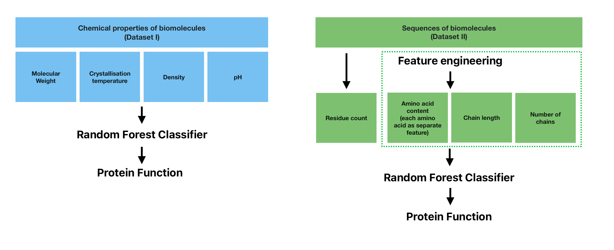
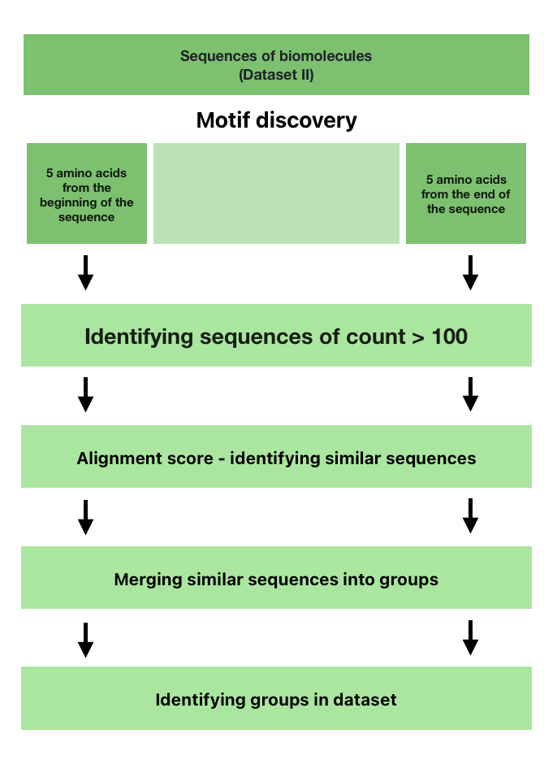
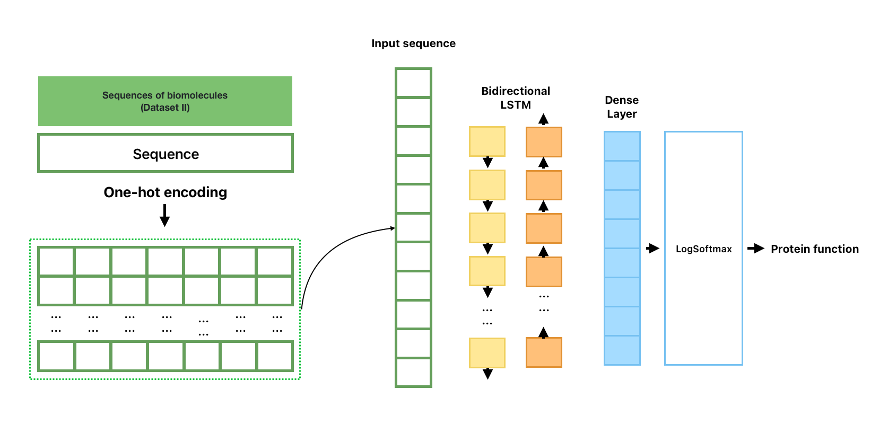
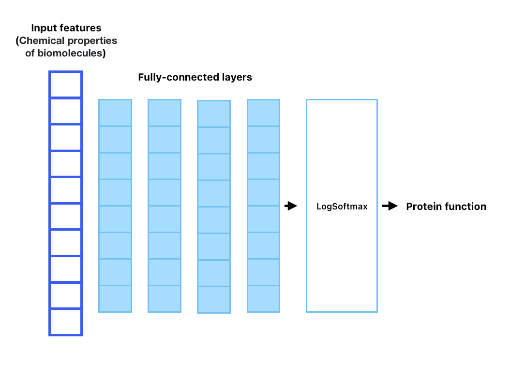
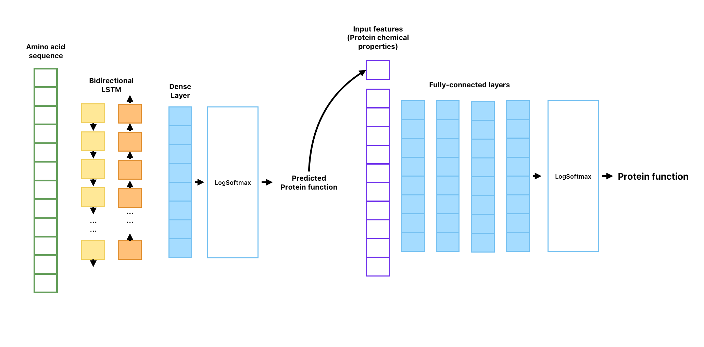
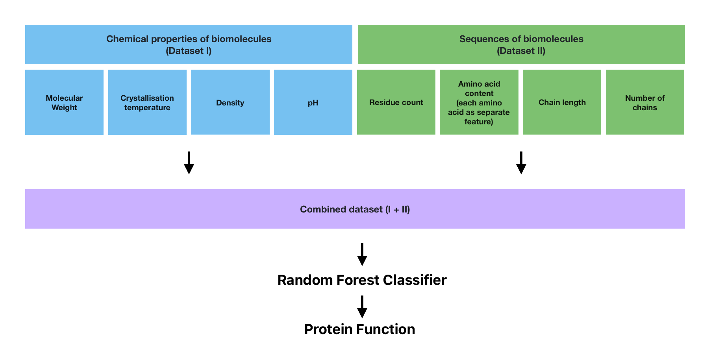

The aim of the project was explore the Protein data and develop some models that will enable to predict protein function based on either: 
- Chemical properties of proteins 
- Protein sequences

## Dataset

The dataset used for this project was downloaded from Kaggle.com: https://www.kaggle.com/datasets/shahir/protein-data-set?select=pdb_data_seq.csv

It consists of 2 files: 
- first one contains information about chemical properties of biomolecules (Data/pdb_data_no_dups.csv) (I)
- second one contains information about sequences (Data/pdb_data_seq.csv) (II)

In the project I decided to focus only on Proteins so I filtered both datasets that way. 
In the first dataset one protein was always treated as a whole molecule. But because a protein can have multiple polypeptide chains the second dataset contained multiple chains for the same protein, often with identical sequences. To prevent data leakage when combining the datasets for training, I decided to keep only the "A" chain from the sequences in the second dataset.

## Project structure

The experiments, data exploration and model development are described in the notebooks 0-7. The final results are described in the 8 notebook.

Baseline models are presented in notebooks 0-2, in which the dataset is described and analysed, feature engineering is performed, and simple predictions are made using Random Forest to establish benchmarks for the project.

In the next step (3), motifs are identified using pairwise alignment from Biopython and specific threshold. The aim was to check whether information about specific beginning and end sequences can enrich the data and improve predictions.

After these tests, PyTorch neural networks were developed and evaluated, starting with the LSTM model, where a bidirectional network was tested using encoded sequences.  
In the 5th notebook, protein features were scaled and used with an NN classifier.

The 6th notebook presents a combined approach. In this method, predictions were first made using the LSTM and then merged with additional features for the classifier.

The final attempt described in notebook 7 leveraged the power of Random Forest with an enriched dataset. By combining chemical features with sequence information and amino acid content, achieved the best results out of all tests.

## Info

*The project was developed for educational purpose only.*

*DISCLAIMER: This code and analysis are provided "as-is" without warranty of any kind, either express or implied, including but not limited to the warranties of merchantability, fitness for a particular purpose, or non-infringement. The author makes no representations regarding the accuracy, completeness, or validity of any data, analysis, or conclusions contained herein. The user acknowledges that they should verify any conclusions or results independently before making decisions based on this content. The author shall not be liable for any damages, including but not limited to direct, indirect, incidental, special, or consequential damages, or any loss of profit, data, or use, arising from the use or inability to use this code and analysis.*